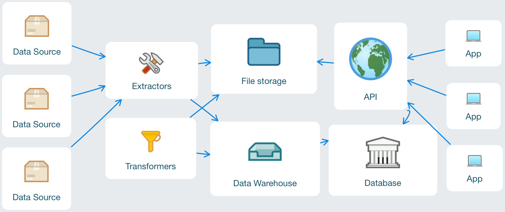
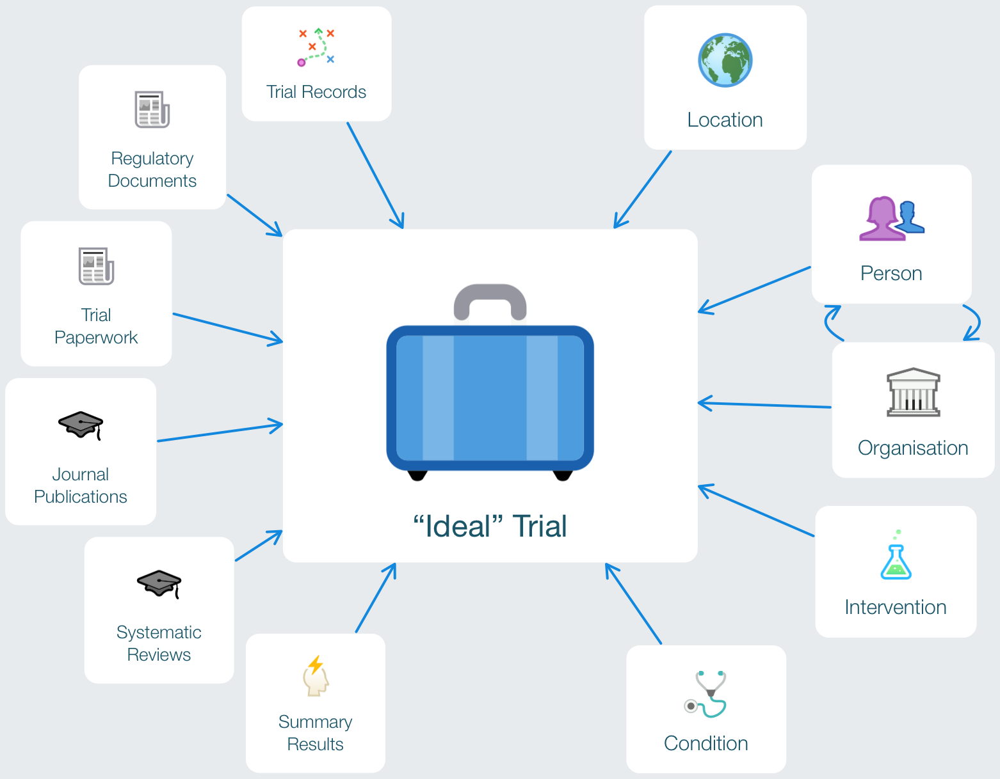

# OpenTrials Technical Roadmap

Hello fans of evidence-based medicine and open data! We'd like to officially announce that the technical work for OpenTrials is underway. Read on for an overview of what we are doing, how we are doing it, and the current roadmap for the first half of 2016. If you have any questions or comments, do not hesitate to ask on Twitter via [@opentrials](https://twitter.com/opentrials) or by email at [opentrials@okfn.org](mailto:opentrials@okfn.org).

## Technical team

Technical work on OpenTrials is conducted by Open Knowledge International. While different people may come into the project at different times, the current technical team is:

-   Sam Smith ([@smth](http://github.com/smth)): User Experience and Design
-   Evgeny Karev ([@roll](http://github.com/roll)): Development
-   Vitor Baptista ([@vitorbaptista](http://github.com/vitorbaptista)): Development
-   Paul Walsh ([@pwalsh](http://github.com/pwalsh)): Technical Lead

Feel free to reach out to any of us via the [OpenTrials organization on GitHub](https://github.com/opentrials).

## Contributing

As with all Open Knowledge International projects, we welcome and encourage contribution. For the technical work on OpenTrials, contributions can mean any or all of code, documentation, bug testing, etc. See our [organization](https://github.com/opentrials) on GitHub, and browse the [unified issue tracker](https://github.com/issues?utf8=✓&q=is%3Aopen+is%3Aissue+user%3Aopentrials+) for all the repositories for interesting tasks to take up.

## Overview

OpenTrials will aggregate information from a wide variety of existing sources, and aims to provide a comprehensive picture of the data and documents on all trials conducted on medicines and other treatments around the world. See the [video](https://www.youtube.com/watch?v=ngVYptGuK0E) for greater context. Here, we are are focused on building the platform.

### Architecture

Let's start with a look at the general architecture of the OpenTrials platform.

OpenTrials will be implemented as a set of loosely coupled components, from data acquisition through to user-facing applications:

-   Extractors and transformers get data from 3rd party sources and process it in our data warehouse, performing tasks from general cleanup through to record matching.
-   Processed data is written to both a file system and a database. The file system hold documents associated with records in the database, as well as flat file representations of data for direct access. The database is normalized SQL representation of the data warehouse plus a search index, each powering an HTTP API.
-   A set of user-facing applications sit on top of the API to provide views on the data.

### Data model

It is important to note that we are not setting out to design a perfectly formed vocabulary around trial data. The data itself is messy, inconsistent, divergent and non-standard. However, we do strive to establish a workable understanding of relations between various entities around clinical trial data.

The diagram centers around our "ideal" representation of a trial, which is derived from the trial records published on public and private registers.

-   The "ideal" representation of a trial will be based on the [WHO Data Set](http://www.who.int/ictrp/network/trds/en/) plus additional fields that cannot be mapped consistently or reliably from the set of trial records we collect.
-   The entities on the left represent the **dimensions** of the data, providing attributes on which to explore and slice the whole OpenTrials database.
-   The entities on the right represent the **facts** of the data, providing attributes that make up everything we know about clinical trials.

## Glossary

We use several terms in the roadmap to describe the various components of the OpenTrials platform. For ease of understanding, here's a short glossary explaining these terms in this context.

-   **Scrapers**: A set of processes run at semi-regular intervals to acquire data in an automated fashion from 3rd parties, and cache the data in the Warehouse. Not all data is technically "scraped" - some is acquired via API or bulk dump access.
-   **Warehouse**: A database used as a staging area for data processing before creating publicly consumable data.
-   **Datastore**: A flat file system with OpenTrials data stored as [Data Packages](http://dataprotocols.org/data-packages/).
-   **Database**: The public database for OpenTrials with cleaned and reconciled data for reading, exposed via the API.
-   **API**: The HTTP API for for data stored in the Database.
-   **Apps**: The publicly accessible applications exposing views on the data stored in the OpenTrials database. Currently, we aim to develop 3 apps:
    -   **OpenTrials**: The main portal for discovery and exploration of clinical trial data.
    -   **Find a Trial**: An app to assist patients and health carers in finding relevant clinical trials.
    -   **Schizophrenia**: An app that uses the OpenTrials API to deep dive into clinical trial data around Schizophrenia.

## Roadmap

Here we'll present a high-level view of shape and development of the OpenTrials platform. We practice agile development at Open Knowledge International, so do not think of this roadmap as a strict plan of action, but rather, as a document that reflects our current thinking and estimates, and is subject to change.

### February - March 2016

####  Goals

-   Seed the Warehouse with core data from clinical trial registers and existing dictionaries for interventions and conditions. See the [scrapers overview](https://github.com/opentrials/scraper#overview) for details and work status.
-   Create the initial Datastore (data as flat files) and Database for the processed data, implementing a loosely structured data model threading trial records from different registers, and related lookup tables for Intervention and Condition entities. The initial threading of trial records will be based on simple de-duplication and record matching strategies using unique identifiers and titles.
-   High-level requirements for robust de-duplication and record matching strategies across trials, interventions and conditions.
-   High-level requirements for the API design, accompanied by a working prototype based on current state of the Database.
-   High-level requirements and UI/X skeletons for the OpenTrials App, accompanied by a working prototype.
-   High-level requirements for matching sources such as journal articles, systematic reviews, and clinical study reports onto clinical trial records, accompanied by some prototype code. A range of target data sources and services are currently on our radar, from PubMed and OpenAccess APIs, through to [Content Mine](http://contentmine.org) and [Epistemonikos](http://epistemonikos.org/).
    
Contact [opentrials@okfn.org](mailto:opentrials@okfn.org) if you have a particular interest in any of the efforts highlighted above, and would like to contribute!
    
####  Outcomes

-   Early read-only access to the Warehouse for interested parties to explore this data through a standard SQL interface.
-   Community feedback on documentation and prototypes for technical design and user interfaces.

### April - May 2016

####  Goals

-   Data acquisition from expanded data sources as identified in previous period. Flow from Warehouse to Datastore to Database to API.
-   Implementation of robust de-duplication and record matching strategies towards increasing the matching success rate over Trials, Sources, Conditions, and Interventions in our Database.
-   Diff implementation over clinical trial records, exposing record discrepancies as published on public registers, accessible as data via API and App.
-   Iteration on the OpenTrials Database and API as we integrate new data sources and record matching strategies.
-   Iteration on the OpenTrials App prototype, towards a beta version that exposes all data available from the OpenTrials API.
-   High-level requirements and UI/X skeletons for the Find a Trial App.
-   High-level requirements and UI/X skeletons for the Schizophrenia App.
    High-level requirements and UI/X skeletons for de-duplication and record matching via crowdsourcing in the OpenTrials App.
-   Outline a range of potential problem sets and ideas for data apps that could be build on the OpenTrials API, for use in a hackathon.

Contact [opentrials@okfn.org](mailto:opentrials@okfn.org) if you have a particular interest in any of the efforts highlighted above, and would like to contribute!

####  Outcomes

-   Access for early adopters to a beta release of the OpenTrials App
-   Expand data sources
-   Increase data quality and quantity exposed via APIs
-   Hackathon in May 2016: Desirable locations being London or Berlin.
-   Community feedback on documentation and prototypes for technical design and user interfaces.

### June - July 2016

####  Goals

-   Continued iteration on data acquisition, record matching, and data modeling -> APIs.
-   User identity management for APIs and Apps.
-   Prototype implementation of user interface for de-duplication and reconciliation.
-   Prototype implementation of Find a Trial App.
-   Prototype implementation of Schizophrenia App.
-   Possible data acquisition targeted for use in the Schizophrenia App.
    
Contact [opentrials@okfn.org](mailto:opentrials@okfn.org) if you have a particular interest in any of the efforts highlighted above, and would like to contribute!

####  Outcomes

-   Prototype versions of Find a Trial and Schizophrenia apps for testing.
-   User accounts, which in turn will enable user-specific actions like saving searches.

### Onwards

Development of OpenTrials will continue throughout 2016 with the broad goals of expanding the database and exposing interfaces for crowdsourcing mechanisms to contribute new data and clean existing data. As the year progresses, we can solidify the roadmap for Q2 2016 based on actual development status, our improved understanding of user needs, and new opportunities around data.

####  Goals

-   Friendly interfaces for individuals and small groups to directly add data to the OpenTrials Warehouse. This data can then enter queues for processing by domain experts to match onto Trials (existing or previously unknown to OpenTrials).
-   Significant data contributions from new data partners.
-   Increased linkage to 3rd party data sources that are directly relevant to clinical trials, but beyond the scope of OpenTrials. An example would be providing links to sources of IPD data for a given trial.

Contact [opentrials@okfn.org](mailto:opentrials@okfn.org) if you have a particular interest in any of the efforts highlighted above, and would like to contribute!

####  Outcomes

-   A stable release of each App by end of 2016.
-   A stable release of the API by the end of 2016.
